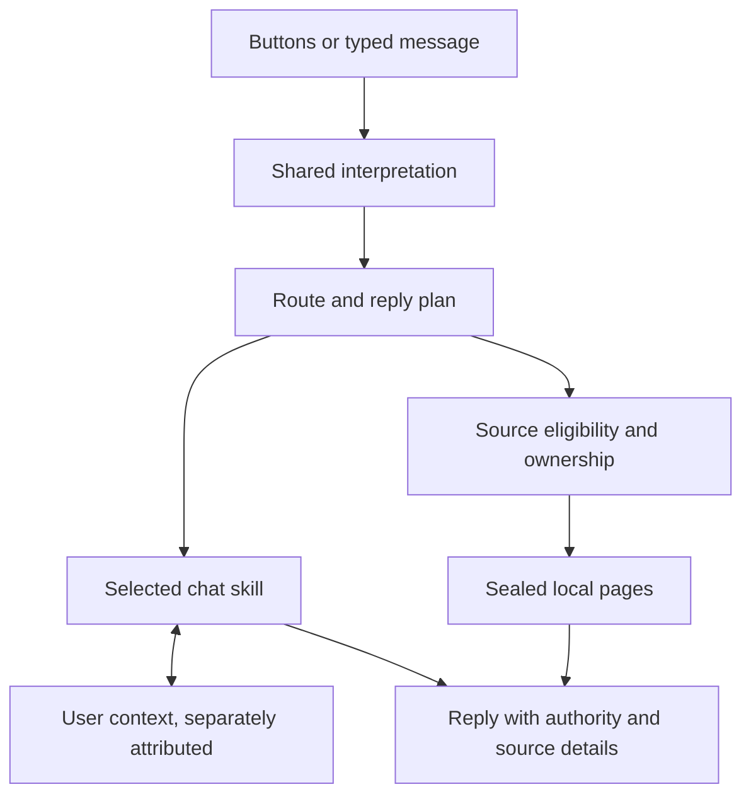

# Architecture and five-minute demonstration

MPLPB is a conversational interface to inspectable local pages. Conversation
planning and evidence ownership are separate. Ownership remains lexical, not a
semantic proof that a page answers a question.



`conversation_continuity` resolves supported references; `conversation_router`
selects top-level intentions; `skill_planner` selects internal skills before
rendering. `chat_environment` plans retrieval. The core reader applies eligibility
and lexical ownership. Unsuccessful attempts do not commit partial conversation
state. The diagram omits optional network ingestion: a crawler/Wikipedia capture
creates local pages before those pages enter the evidence path.

## Preparation (outside the five minutes)

Use Python 3.8+ in a fresh checkout and install with `python -m pip install -e .`.
No API key or network crawler is needed for the terminal demo. Open this document,
`docs/CONVERSATION_ARCHITECTURE.md`, and the ownership results. The browser demo is
optional; source downloads can vary, so use the terminal version for reproducibility.

## Timed walkthrough

**0:00–1:00 — Boundaries.** Walk through the diagram. Explain that user-declared
memory is not ledger evidence and a hash is not a truth certificate.

**1:00–2:00 — Conversation continuity.** Run:

```sh
python -m tools.demo_architecture
```

The script prints an introduction, compound declaration/question, correction,
recall, and literal repetition after an emotional preference. Point to the reply
plan, mode and source count. It uses a temporary store, never a developer's saved chat.

**2:00–3:00 — Inspection.** Open `tools/skill_planner.py`. Show pure candidate
recognition, selection, then isolated execution. Explain that authored priorities
are not probabilities and unknown language can still fail.

**3:00–4:00 — Deliberately break ownership.** Run:

```sh
python -m tools.evaluate_ownership
```

Show the missing-attribute or wrong-entity row in `evaluation/ownership/results.json`.
An eligible, intact page can own a query lexically while lacking its answer. The
75% stress-set failure rate is a disclosed limitation, not a regression to conceal.

**4:00–5:00 — Contribution contract.** Show `PRODUCTION_THREAT_MODEL.md` and the
RAG comparison protocol. Ask the newcomer to propose an unfamiliar conversation
and an unsupported-owner example before reading existing patterns. Add a frozen
case, review the expected evidence, then change code. Passing tests protect known
behavior; they do not establish unrestricted natural conversation.
